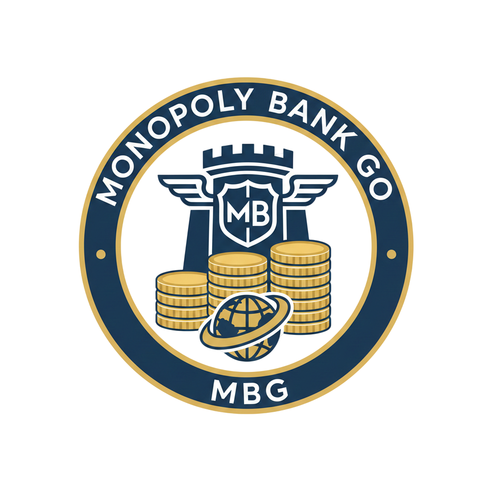

# Monopoly Bank Go (MBG)


Digital bank untuk permainan Monopoly dengan kartu pemain NFC (NTAG215) menggunakan Web NFC.

## Tech stack

- Next.js (App Router)
- PostgreSQL + Prisma ORM v7 (`prisma.config.ts`)
- NextAuth Credentials (admin bank)
- Mantine UI + Tabler Icons
- TanStack Query
- Web NFC API (Chrome Android)

## Setup

### 1) Install

```bash
npm install
```

### 2) Environment variables

Copy contoh env dan isi koneksi Postgres + secret NextAuth:

```bash
cp .env.example .env
```

Minimal yang dibutuhkan:

- `DATABASE_URL`
- `NEXTAUTH_SECRET`
- `NEXTAUTH_URL`

Untuk fitur register + verifikasi email (Gmail SMTP):

- `GMAIL_USER`
- `GMAIL_APP_PASSWORD` (App Password Gmail)
- `EMAIL_FROM` (opsional; default pakai `GMAIL_USER`)

### 3) Prisma migrate + generate

Pastikan Postgres sudah berjalan, lalu:

```bash
npx prisma migrate dev --name init --config ./prisma.config.ts
npx prisma generate --config ./prisma.config.ts
```

### 4) Seed template transaksi

Seed akan membuat admin default + template transaksi Monopoly:

```bash
npx prisma db seed --config ./prisma.config.ts
```

Default login (bisa diubah via env `ADMIN_EMAIL`/`ADMIN_PASSWORD` sebelum seed):

- email: `admin@example.com`
- password: `admin123`

### 5) Run

```bash
npm run dev
```

Buka http://localhost:3000

## Web NFC notes

- Web NFC hanya berjalan di Chrome Android.
- Umumnya butuh HTTPS
- Flow app:
	- Buat game (Dashboard / Games)
	- Registrasi pemain + scan UID NFC (Players)
	- Buat transaksi: scan pemain sumber, (opsional) scan tujuan, submit (Transactions)

## API routes

- `POST /api/game/create`
- `POST /api/player/register`
- `POST /api/nfc/scan`
- `POST /api/transaction/create`
- `GET /api/dashboard/summary`
